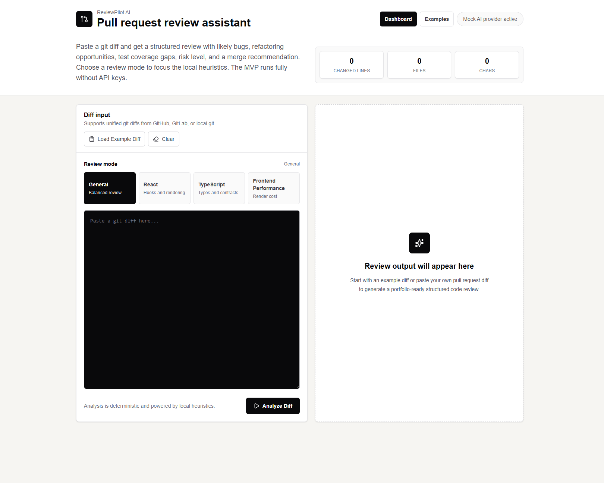
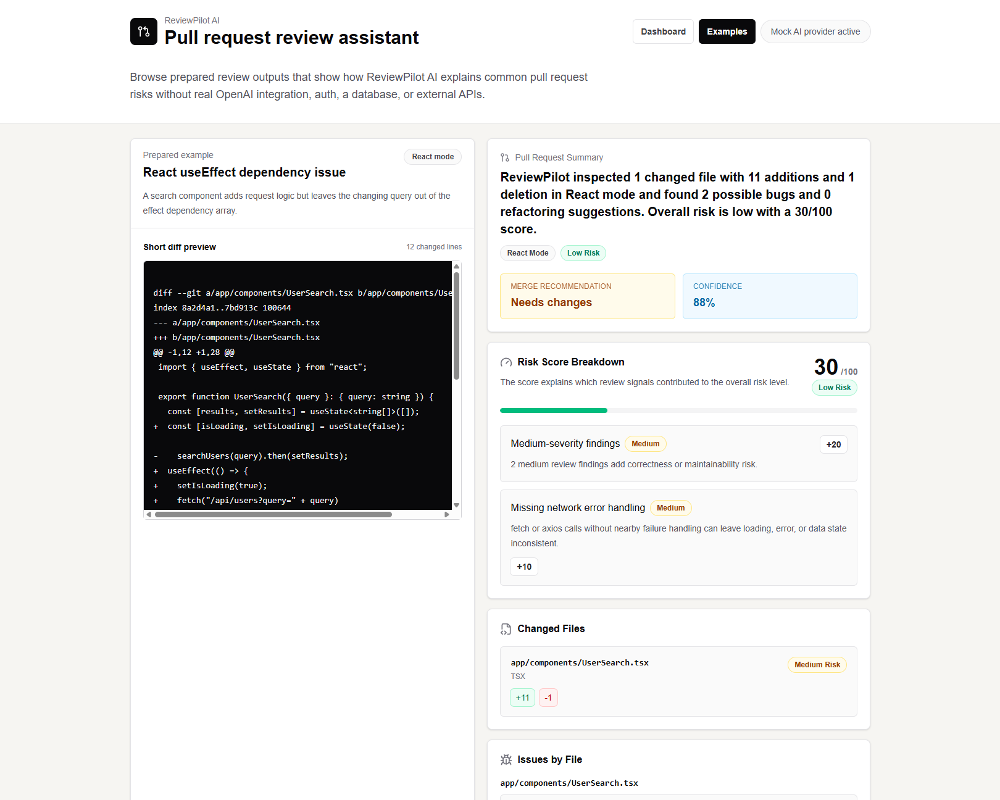
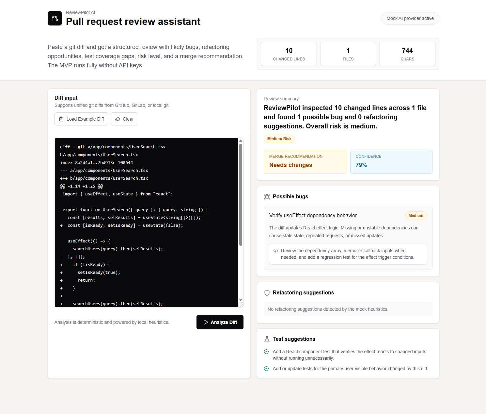

# ReviewPilot AI

ReviewPilot AI is a portfolio-ready Pull Request review assistant built with
Next.js, React, TypeScript, Tailwind CSS, and Zod. It turns a pasted git diff
into structured code review feedback: pull request summary, changed-file risk,
line-aware issues, explainable risk scoring, test suggestions, confidence, and
merge recommendation.

The current release uses `MockAIProvider`, a deterministic local provider that
requires no API keys or external services. The project is intentionally designed
so a real LLM provider can be added later behind the same provider interface and
validated response schema.

## Problem / Solution

Pull request review feedback is often inconsistent, hard to scan, or buried in
long conversational comments. ReviewPilot AI demonstrates how an AI-assisted
review workflow can parse raw unified diffs into predictable, review-ready
sections that are easier to evaluate.

The solution is a small but complete app with an interactive diff analyzer,
focused review modes, line-based findings, a structured API contract, and
prepared examples for live portfolio demos.

## Screenshots

| Dashboard                                        | Examples                                       | Review result                                            |
| ------------------------------------------------ | ---------------------------------------------- | -------------------------------------------------------- |
|  |  |  |

## Features

- Paste unified git diffs from GitHub, GitLab, or local `git diff` output.
- Parse changed files, hunks, additions, deletions, and line numbers.
- Select a focused review mode before analysis.
- View changed line, file, and character counts.
- Receive location-aware feedback for possible bugs, refactoring, and tests.
- Review changed-file cards with language, additions, deletions, and risk.
- Inspect issue cards grouped by file with line numbers and code snippets.
- See a 0-100 risk score, risk factor breakdown, confidence, and merge
  recommendation.
- Load bundled example diffs from the dashboard.
- Browse prepared reports on `/examples`.
- Run entirely locally with `MockAIProvider`.

## Review Modes

| Mode                 | Focus                                                                  |
| -------------------- | ---------------------------------------------------------------------- |
| General              | Broad pull request risks, error handling, security, and large diffs.   |
| React                | Effects, memoization, list rendering, keys, props, and component flow. |
| TypeScript           | `any`, assertions, compiler suppressions, and typed API contracts.     |
| Frontend Performance | Inline props, render cost, array work, large lists, and derived state. |

## Architecture

ReviewPilot AI separates the dashboard, API contract, validation, and provider
logic:

- `app/page.tsx` renders the interactive diff analyzer.
- `app/examples/page.tsx` renders prepared portfolio examples.
- `app/api/review/route.ts` accepts review requests and returns validated JSON.
- `lib/schemas/review.ts` defines Zod request and response schemas.
- `lib/diff/parseDiff.ts` parses unified diffs into files, hunks, and lines.
- `lib/ai/reviewProvider.ts` defines the provider interface.
- `lib/ai/getReviewProvider.ts` selects the active provider from environment
  configuration.
- `lib/ai/mockReview.ts` implements `MockAIProvider` with deterministic
  heuristics and explainable risk factors over parsed diff data.
- `lib/ai/openAIReviewProvider.ts` implements the optional OpenAI-compatible
  provider with direct `fetch`, strict JSON prompting, and Zod validation.
- `app/components/review-result.tsx` renders reusable review report UI.

See [docs/architecture.md](./docs/architecture.md) for the detailed
request/response flow and future LLM integration path.

## Pages

| Route       | Purpose                          |
| ----------- | -------------------------------- |
| `/`         | Interactive diff analyzer.       |
| `/examples` | Prepared example review reports. |

## Tech Stack

- Next.js 16 App Router
- React 19
- TypeScript
- Tailwind CSS 4
- Zod
- Lucide React
- ESLint
- Prettier

## How to Run Locally

Install dependencies:

```bash
npm install
```

Create local environment variables:

```bash
cp .env.example .env.local
```

Start the development server:

```bash
npm run dev
```

Open `http://localhost:3000`.

Prepared examples are available at `http://localhost:3000/examples`.

## AI Integration

ReviewPilot AI is safe to run without API keys because `MockAIProvider` is the
default. To demonstrate production AI integration patterns, the app also
includes an optional OpenAI-compatible provider behind the same
`ReviewProvider` interface.

Enable the real provider with environment variables:

```bash
AI_PROVIDER=openai
OPENAI_API_KEY=your_api_key
OPENAI_MODEL=gpt-5.4-mini
```

If `AI_PROVIDER` is missing or invalid, the provider factory falls back to the
mock provider. In OpenAI mode, prompts ask for strict JSON only, model output is
parsed, and the result must pass the Zod `ReviewResultSchema` before it reaches
the API response. Invalid JSON, invalid schema output, or missing configuration
is rejected with a clear API error instead of being silently accepted.

## Example Input / Output

Request:

```json
{
	"diff": "diff --git a/app/components/UserSearch.tsx b/app/components/UserSearch.tsx\n...",
	"mode": "react"
}
```

Response:

```json
{
	"summary": "ReviewPilot inspected 1 changed file with 10 additions and 1 deletion in React mode and found 2 possible bugs and 0 refactoring suggestions. Overall risk is low with a 30/100 score.",
	"overallRisk": "low",
	"riskScore": 30,
	"riskFactors": [
		{
			"label": "Medium-severity findings",
			"impact": 20,
			"severity": "medium",
			"reason": "2 medium review findings add correctness or maintainability risk."
		},
		{
			"label": "Missing network error handling",
			"impact": 10,
			"severity": "medium",
			"reason": "fetch or axios calls without nearby failure handling can leave loading, error, or data state inconsistent."
		}
	],
	"changedFiles": [
		{
			"filePath": "app/components/UserSearch.tsx",
			"language": "TSX",
			"additions": 10,
			"deletions": 1,
			"riskLevel": "medium"
		}
	],
	"possibleBugs": [
		{
			"title": "Verify useEffect dependencies",
			"severity": "medium",
			"location": {
				"filePath": "app/components/UserSearch.tsx",
				"lineNumber": 7,
				"codeSnippet": "useEffect(() => {"
			},
			"description": "This added effect should be checked for stale closures, incomplete dependencies, and repeated side effects.",
			"suggestedFix": "Confirm every value read inside the effect is represented in the dependency array or intentionally stable."
		}
	],
	"refactoringSuggestions": [],
	"testSuggestions": [
		"Add a React component test that verifies the effect reacts to changed inputs without running unnecessarily.",
		"Add or update tests for the primary user-visible behavior changed by this diff."
	],
	"mergeRecommendation": "needs_changes",
	"confidence": 0.83
}
```

More examples are documented in
[docs/example-output.md](./docs/example-output.md).

## Scripts

| Command                | Description                                 |
| ---------------------- | ------------------------------------------- |
| `npm run dev`          | Start the local development server.         |
| `npm run build`        | Create a production build.                  |
| `npm run start`        | Start the production server after building. |
| `npm run lint`         | Run ESLint.                                 |
| `npm run test`         | Run Vitest unit tests.                      |
| `npm run test:watch`   | Run Vitest in watch mode.                   |
| `npm run eval:mock`    | Run deterministic golden-case AI evals.     |
| `npm run format`       | Format files with Prettier.                 |
| `npm run format:check` | Check formatting without writing changes.   |

## CI / Quality Checks

GitHub Actions runs quality checks on pushes and pull requests targeting
`main`. The CI workflow installs dependencies with `npm ci`, then runs the same
quality gates expected before release: format checking, linting, Vitest tests,
mock AI evals, and a production build.

Run the CI checks locally:

```bash
npm run format:check
npm run lint
npm run test
npm run eval:mock
npm run build
```

## AI Evals

The `evals/` directory contains golden cases for core review behaviors such as
React hook risk, weak TypeScript typing, raw HTML security risk, and missing
network error handling. These cases document what good review output should
catch and provide a lightweight way to compare provider output against expected
findings.

Run the deterministic mock evals:

```bash
npm run eval:mock
```

The eval script forces mock mode and never calls external APIs. Production AI
integrations should be evaluated against representative cases like these, not
only tested manually through the UI.

## Testing

The core review logic is covered with Vitest:

- `lib/diff/parseDiff.ts` tests cover unified diff parsing, file paths,
  languages, additions, deletions, hunks, line numbers, package changes, and
  invalid input.
- `lib/ai/mockReview.ts` tests cover location-aware heuristics for React,
  TypeScript, network error handling, XSS risk, cleanup findings, changed-file
  summaries, explainable risk scores, sensitive file paths, package changes,
  score-to-risk mapping, and Zod response validation.

Run the tests:

```bash
npm run test
```

## Future Improvements

- Add streaming review progress for larger diffs.
- Add repository-aware context ingestion for changed files.
- Add authentication and saved review history.
- Add GitHub pull request import and webhook support.
- Add automated screenshot generation for release docs.

## Release Checklist

- Run quality checks locally.
- Capture fresh screenshots for the README.
- Push the repository to GitHub.
- Deploy the app to Vercel.

## License

MIT. See [LICENSE](./LICENSE).
