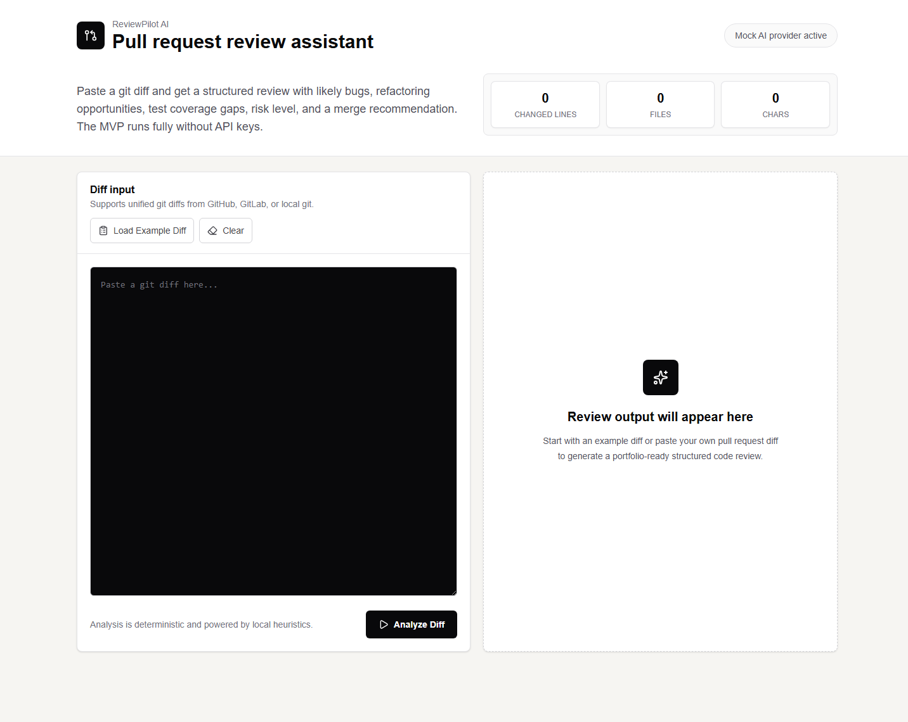

# ReviewPilot AI

ReviewPilot AI is a small Next.js app that reviews pasted git diffs and returns a structured pull request review.

The current version uses a local mock AI provider, so it works without API keys or external services.

## Preview

| Empty dashboard                                                             | Review result                                                                     |
| --------------------------------------------------------------------------- | --------------------------------------------------------------------------------- |
|  |  |

## What It Does

- Accepts unified git diffs from GitHub, GitLab, or local `git diff` output.
- Supports focused review modes: General, React, TypeScript, and Frontend Performance.
- Shows quick diff stats: changed lines, touched files, and character count.
- Detects likely bug risks with local heuristics.
- Suggests refactoring opportunities and missing test coverage.
- Returns an overall risk level, confidence score, and merge recommendation.
- Includes bundled example diffs for quick demos.

## Tech Stack

- Next.js 16
- React 19
- TypeScript
- Tailwind CSS 4
- Zod
- Lucide React

## Getting Started

Install dependencies:

```bash
npm install
```

Start the development server:

```bash
npm run dev
```

Open `http://localhost:3000`.

## Scripts

| Command                | Description                                 |
| ---------------------- | ------------------------------------------- |
| `npm run dev`          | Start the local development server.         |
| `npm run build`        | Create a production build.                  |
| `npm run start`        | Start the production server after building. |
| `npm run lint`         | Run ESLint.                                 |
| `npm run format`       | Format files with Prettier.                 |
| `npm run format:check` | Check formatting without writing changes.   |

## API

`POST /api/review`

Request body:

```json
{
  "diff": "diff --git a/app/page.tsx b/app/page.tsx\n...",
  "mode": "react"
}
```

Supported `mode` values:

| Mode          | Focus                                                                  |
| ------------- | ---------------------------------------------------------------------- |
| `general`     | Balanced review for broad pull request risks.                          |
| `react`       | Hooks, memoization, list rendering, and prop flow.                     |
| `typescript`  | Type safety, assertions, compiler suppressions, and API contracts.     |
| `performance` | Render cost, inline props, expensive collection work, and large lists. |

Response shape:

```json
{
  "summary": "ReviewPilot inspected 42 changed lines across 2 files in React mode...",
  "overallRisk": "medium",
  "possibleBugs": [],
  "refactoringSuggestions": [],
  "testSuggestions": [],
  "mergeRecommendation": "needs_changes",
  "confidence": 0.82
}
```

## Project Structure

| Path                       | Purpose                                                  |
| -------------------------- | -------------------------------------------------------- |
| `app/page.tsx`             | Main review workspace UI.                                |
| `app/api/review/route.ts`  | Review API endpoint.                                     |
| `lib/ai/mockReview.ts`     | Local deterministic review heuristics.                   |
| `lib/ai/reviewProvider.ts` | Provider interface for future AI integrations.           |
| `lib/schemas/review.ts`    | Request and response schemas.                            |
| `data/exampleDiffs.ts`     | Demo diffs used by the UI.                               |
| `docs/example-output.md`   | Example API requests and responses for each review mode. |
| `public/screenshots/`      | README screenshots.                                      |

## Notes

The mock provider is deterministic and intended for local demos. It can be replaced later with a real LLM-backed provider while keeping the same API response schema.
