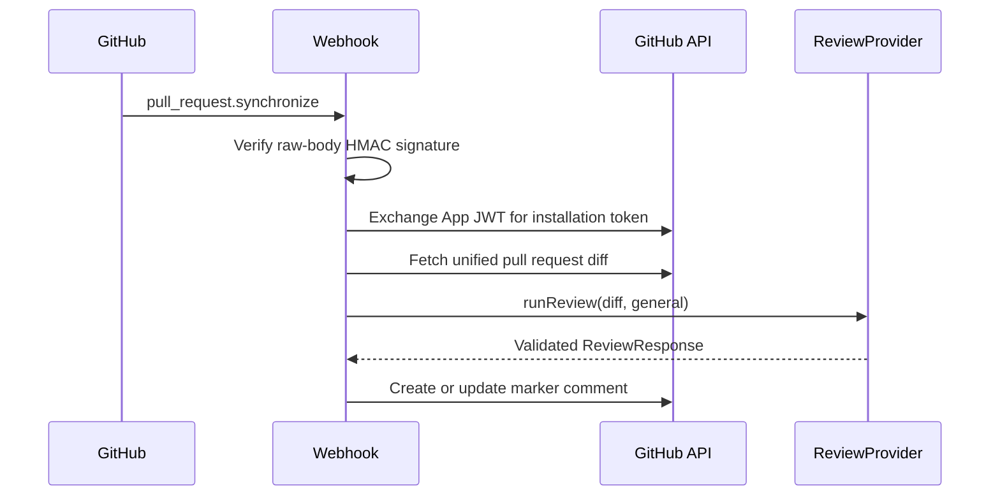

# Architecture

ReviewPilot AI is organized around a stable review contract and a replaceable
AI provider. The UI does not know whether a response came from deterministic
local heuristics or a future LLM service.

## Request / Response Flow

1. The dashboard in `app/page.tsx` collects a git diff and `ReviewMode`.
2. The client posts `{ diff, mode }` to `POST /api/review`.
3. `app/api/review/route.ts` validates the request with `reviewRequestSchema`.
4. The route calls `getReviewProvider()`.
5. The provider factory reads `AI_PROVIDER` and returns `MockAIProvider` by
   default or `OpenAIReviewProvider` when explicitly configured.
6. The active provider returns a `ReviewResponse`.
7. The API validates the provider result with `reviewResponseSchema` /
   `ReviewResultSchema`.
8. The UI renders the response with the shared `ReviewResult` component.

Both the manual route and GitHub webhook call `lib/review/runReview.ts`. This
application service invokes the selected `ReviewProvider` and validates its
result, so review behavior is not duplicated between transport layers.

## GitHub App Flow



The webhook route handles HTTP concerns only: required headers, signature,
event filtering, payload schema validation, delivery deduplication, safe error
mapping, and dependency construction. `processPullRequestEvent` orchestrates
authentication, diff retrieval, shared review execution, Markdown formatting,
and comment upsert through mockable interfaces.

GitHub App authentication uses an RS256 JWT signed with the App private key and
exchanges it for a short-lived installation token. The REST client requests the
PR's ready-made unified diff rather than reconstructing it from file endpoints.
Issue comments are explicitly paginated. An existing comment is editable only
when it has the hidden ReviewPilot marker and GitHub reports that it was created
via the configured App ID.

The route uses the Node.js runtime for `node:crypto`. Webhook HMAC validation is
performed over the exact raw UTF-8 request body and uses timing-safe comparison.
The integration never logs payloads, diffs, private keys, secrets, API keys, or
installation tokens.

The `/examples` page reuses the same provider and `ReviewResult` component, but
it renders prepared reports server-side for a static portfolio-friendly route.

## Provider-Based Architecture

The provider interface lives in `lib/ai/reviewProvider.ts`:

```ts
export interface ReviewProvider {
	reviewDiff(diff: string, mode: ReviewMode): Promise<ReviewResponse>;
}
```

`MockAIProvider` implements that interface in `lib/ai/mockReview.ts`.
`OpenAIReviewProvider` implements the same interface in
`lib/ai/openAIReviewProvider.ts`. The API route depends on the interface and
provider factory, not a concrete provider, so mock and LLM-backed reviews share
the same UI and response contract.

Provider flow:

```text
API route
  -> getReviewProvider()
  -> MockAIProvider or OpenAIReviewProvider
  -> reviewResponseSchema / ReviewResultSchema validation
  -> ReviewResult UI
```

If `AI_PROVIDER` is missing, set to `mock`, or set to an invalid value, the
factory returns `MockAIProvider`. `AI_PROVIDER=openai` selects the optional
OpenAI-compatible provider.

## Unified Diff Parsing

`lib/diff/parseDiff.ts` converts common git unified diff format into structured
data:

- files from `diff --git a/path b/path`
- old and new paths from `---` and `+++`
- hunks from `@@ -oldStart,oldLines +newStart,newLines @@`
- added, deleted, and context lines
- old and new line numbers for each parsed line
- language labels inferred from file extension

The parser is intentionally lightweight and local. It supports the common diff
shape produced by GitHub, GitLab, and `git diff` without adding another runtime
package.

## Zod Validation

`lib/schemas/review.ts` defines the request and response schema:

- `reviewRequestSchema` validates non-empty diffs, maximum diff length, and
  supported review modes.
- `reviewResponseSchema` validates summary, overall risk, 0-100 risk score,
  risk factors, changed-file summaries, location-aware issues, test
  suggestions, merge recommendation, and confidence.

The API validates both incoming requests and outgoing provider responses. This
keeps malformed provider output from leaking into the UI and gives a future LLM
integration a clear contract.

## Mock AI Heuristics

`MockAIProvider` is deterministic and runs locally. It looks at parsed files and
added lines for review signals such as:

- `useEffect` additions tied to the exact file and new line.
- `any` additions tied to service or component files.
- `fetch` and `axios` additions without nearby error handling.
- `dangerouslySetInnerHTML` additions marked as high risk.
- `console.log` and `TODO` cleanup findings.
- package metadata changes marked as release-impacting medium risk.
- auth, payment, security, and config paths marked as higher-risk files.
- large additions increasing file-level risk.

The same signals are converted into `riskFactors`, each with a label, impact,
severity, and reason. The provider sums those impacts, caps the score at 100,
and maps the score to overall risk:

| Score  | Overall risk |
| ------ | ------------ |
| 0-34   | `low`        |
| 35-69  | `medium`     |
| 70-100 | `high`       |

## OpenAI-Compatible Provider

`OpenAIReviewProvider` is optional and uses direct `fetch` instead of an SDK. It
reads:

- `OPENAI_API_KEY`, required only when `AI_PROVIDER=openai`.
- `OPENAI_MODEL`, optional, defaulting to `gpt-5.4-mini`.

The provider parses the diff locally, sends the unified diff, parsed diff
metadata, selected review mode, strict JSON instructions, location rules, and
risk scoring guidance to the model. The response is parsed as JSON and validated
with Zod. Invalid JSON, invalid schema output, OpenAI API errors, and missing
API keys produce clear errors that the API route returns as JSON.

## Changed Files Summary

Every response includes `changedFiles`, a list of file cards for the UI:

```ts
{
	filePath: string;
	language: string;
	additions: number;
	deletions: number;
	riskLevel: "low" | "medium" | "high";
}
```

Responses also include an explainable score:

```ts
{
	riskScore: number;
	riskFactors: Array<{
		label: string;
		impact: number;
		severity: "low" | "medium" | "high";
		reason: string;
	}>;
}
```

Issues can also include a location:

```ts
{
  filePath: string;
  lineNumber?: number;
  codeSnippet?: string;
}
```

This makes the result feel closer to a real pull request review because
feedback points to a file, line, and snippet instead of only describing the diff
globally.

The goal is not to replace a real reviewer. The goal is to demonstrate the
product shape, validation model, and provider contract without requiring API
keys or external services.

## Fallback Behavior

The project remains demo-friendly without external services. Mock mode is the
default and requires no API keys. OpenAI mode is opt-in and fails fast when
configuration is missing or model output does not match the schema. Tests do not
call external APIs.

## Tested Core Modules

Vitest covers the core logic that makes the demo behave like a real pull
request review tool:

- `lib/diff/parseDiff.ts` is tested for single-file diffs, multi-file diffs,
  additions, deletions, old and new paths, language detection, old and new line
  numbers, package changes, and invalid input.
- `lib/ai/mockReview.ts` is tested for location-aware React, TypeScript,
  network, security, cleanup, package, sensitive-path heuristics, risk factors,
  and score-to-risk mapping.
- Provider integration tests cover default mock selection, invalid-provider
  fallback, OpenAI provider selection, schema rejection of invalid LLM-like
  output, and missing OpenAI API key errors.
- Provider output is validated in tests with `reviewResponseSchema`, so schema
  drift between provider logic and UI expectations is caught early.
